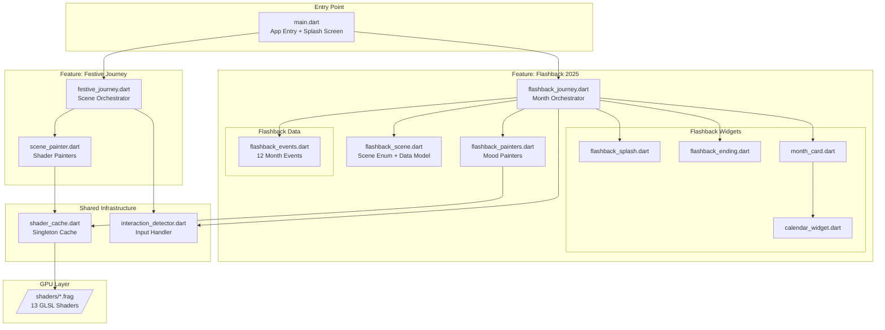

# Software Architecture Blueprint

## Flutter Shader Example - Festive Journey & Flashback 2025

**Generated**: December 30, 2025
**Project Type**: Flutter Application (Mobile/Web/Desktop)
**Architectural Style**: Feature-Based Architecture with Layered Components
**Complexity Level**: Medium (Rich UI, Custom Rendering, State Management)

---

## Executive Summary

This Flutter application showcases GPU-powered fragment shader animations through two main experiences:

1. **Festive Journey** - A 7-scene shader celebration from Christmas to New Year
2. **Flashback 2025** - A 12-month year-in-review with mood-appropriate shader effects

### Key Architectural Decisions

| Decision | Choice | Rationale |
|----------|--------|-----------|
| Architecture Pattern | Feature-Based + Layered | Separates two distinct experiences while sharing infrastructure |
| Rendering Strategy | CustomPainter + FragmentShader | Flutter's native shader API for GPU-accelerated effects |
| State Management | StatefulWidget + AnimationController | Sufficient for animation-heavy, single-screen experiences |
| Asset Management | Singleton Cache Pattern | Preload shaders to avoid runtime compilation jank |
| Code Reuse | Abstract Base Classes + Composition | DRY enforcement via FlashbackPainter base class |

---

## System Architecture Diagram



---

## Component Boundaries

### Feature Modules

| Feature | Responsibility | Directory |
|---------|---------------|-----------|
| **Festive Journey** | Original 7-scene shader showcase | `lib/scenes/` |
| **Flashback 2025** | Year-in-review with 12 months | `lib/flashback/` |
| **Shared Infrastructure** | Caching, input handling | `lib/shaders/`, `lib/widgets/` |
| **Shaders** | GLSL fragment programs | `shaders/` |

### Boundary Rules

```
+------------------+     +------------------+
|  Festive Journey |     |  Flashback 2025  |
|                  |     |                  |
|  - festive_      |     |  - flashback_    |
|    journey.dart  |     |    journey.dart  |
|  - scene_        |     |  - flashback_    |
|    painter.dart  |     |    painters.dart |
|                  |     |  - widgets/      |
|                  |     |  - data/         |
+--------+---------+     +--------+---------+
         |                        |
         v                        v
+------------------------------------------+
|          Shared Infrastructure           |
|                                          |
|  - shader_cache.dart (Singleton)         |
|  - interaction_detector.dart             |
+------------------------------------------+
         |
         v
+------------------------------------------+
|              GPU/Shader Layer            |
|                                          |
|  - 7 Festive shaders                     |
|  - 6 Flashback shaders                   |
+------------------------------------------+
```

**Dependency Rules**:
- Features NEVER import from each other
- Both features depend on shared infrastructure
- Shared infrastructure has no feature dependencies
- All Dart code depends on shaders via asset paths (strings)

---

## Layer Definitions

### Layer 1: Presentation (UI)

**Components**: main.dart, *_journey.dart, widgets/

**Responsibilities**:
- User interface rendering
- Navigation between features
- Animation orchestration
- User input handling

**Dependencies**: Domain, Infrastructure

### Layer 2: Domain (Business Logic)

**Components**: *_scene.dart, *_events.dart, *_painters.dart

**Responsibilities**:
- Scene state definitions (enums)
- Event data models (FlashbackMonth)
- Shader painter logic (uniform binding)
- Business rules (scene transitions, mood mapping)

**Dependencies**: Infrastructure (shaders only)

### Layer 3: Infrastructure

**Components**: shader_cache.dart, interaction_detector.dart

**Responsibilities**:
- Shader program caching
- Input event normalization
- Resource lifecycle management

**Dependencies**: Flutter framework, GLSL assets

### Layer 4: GPU/Assets

**Components**: shaders/*.frag

**Responsibilities**:
- Visual rendering via GLSL
- Uniform-driven parameterization
- Cross-platform GPU abstraction

---

## Design Patterns Registry

### Pattern: Singleton (Shader Cache)

**Purpose**: Ensure single instance of shader cache across app

**Implementation**: `ShaderCache.instance`

```dart
class ShaderCache {
  ShaderCache._();
  static final ShaderCache instance = ShaderCache._();

  final Map<String, FragmentProgram> _programs = {};
  final Map<String, FragmentShader> _shaders = {};
}
```

**Usage**: Preload once, access anywhere

### Pattern: Template Method (Painter Base Class)

**Purpose**: Define shader painting algorithm, let subclasses provide uniforms

**Implementation**: `FlashbackPainter` abstract class

```dart
abstract class FlashbackPainter extends CustomPainter {
  @override
  void paint(Canvas canvas, Size size) {
    setUniforms(size);  // Template method - subclass implements
    canvas.drawRect(Offset.zero & size, Paint()..shader = shader);
  }

  void setUniforms(Size size);  // Abstract - each painter implements
}
```

**Subclasses**: FirePainter, EarthquakePainter, RainbowPainter, etc.

### Pattern: State Machine (Scene Navigation)

**Purpose**: Manage scene transitions with defined states

**Implementation**: `FlashbackScene` enum with `next`/`previous` getters

```dart
enum FlashbackScene {
  splash, january, february, ..., december, ending;

  FlashbackScene? get next => index < values.length - 1 ? values[index + 1] : null;
  FlashbackScene? get previous => index > 0 ? values[index - 1] : null;
}
```

### Pattern: Data Class (Event Model)

**Purpose**: Immutable configuration for each month event

**Implementation**: `FlashbackMonth` const class

```dart
class FlashbackMonth {
  const FlashbackMonth({
    required this.month,
    required this.monthName,
    required this.highlightDay,
    required this.eventTitle,
    required this.eventDescription,
    required this.mood,
    required this.imageUrl,
    required this.shaderAsset,
    required this.primaryColor,
    required this.secondaryColor,
    required this.displayDuration,
  });
}
```

### Pattern: Factory Method (Painter Selection)

**Purpose**: Create appropriate painter based on shader asset

**Implementation**: In `_FlashbackJourneyState._buildMonthPainter()`

```dart
CustomPainter? _buildMonthPainter(FlashbackMonth event, FragmentShader shader, double time) {
  return switch (event.shaderAsset) {
    'shaders/flashback_fire.frag' => FlashbackFirePainter(...),
    'shaders/flashback_earthquake.frag' => FlashbackEarthquakePainter(...),
    'shaders/flashback_rainbow.frag' => FlashbackRainbowPainter(...),
    // ... etc
  };
}
```

---

## Separation of Concerns Strategy

### Concern: Visual Effects (Shaders)

**Location**: `shaders/*.frag`

**Rule**: All GPU-side visual logic in GLSL files only

**Violations to avoid**:
- Color calculations in Dart (do in shader)
- Animation math in Dart when shader can handle it

### Concern: Uniform Binding (Painters)

**Location**: `*_painters.dart`

**Rule**: One painter class per shader with matching uniform contract

**Violations to avoid**:
- Setting uniforms directly in journey/widget code
- Mixing multiple shader logics in one painter

### Concern: Scene Flow (Journey)

**Location**: `*_journey.dart`

**Rule**: Only orchestration logic - which scene, when to transition

**Violations to avoid**:
- UI widget building in journey (extract to widgets/)
- Data definitions in journey (extract to data/)

### Concern: Data Definition (Models)

**Location**: `*_scene.dart`, `data/*.dart`

**Rule**: Pure data, no rendering logic

**Violations to avoid**:
- Widget building in data classes
- Shader logic in data classes

### SoC Enforcement Checklist

| Check | Pass Criteria |
|-------|--------------|
| Shader logic isolation | No color/animation math in Dart that could be in GLSL |
| Painter focus | Each painter handles exactly one shader |
| Journey orchestration | Journey files only manage scene state, not rendering |
| Widget extraction | Complex UI in separate widget files |
| Data purity | Data classes have no dependencies on Flutter widgets |

---

## Don't Repeat Yourself Guidelines

### Achieved DRY Patterns

#### 1. Abstract Painter Base Class

**Before** (violated DRY):
```dart
class FirePainter extends CustomPainter {
  void paint(Canvas canvas, Size size) {
    shader.setFloat(0, size.width);
    shader.setFloat(1, size.height);
    shader.setFloat(2, time);
    // ... effect-specific
    canvas.drawRect(Offset.zero & size, Paint()..shader = shader);
  }
}

class RainPainter extends CustomPainter {
  void paint(Canvas canvas, Size size) {
    shader.setFloat(0, size.width);  // DUPLICATE
    shader.setFloat(1, size.height); // DUPLICATE
    shader.setFloat(2, time);        // DUPLICATE
    // ... effect-specific
    canvas.drawRect(Offset.zero & size, Paint()..shader = shader);  // DUPLICATE
  }
}
```

**After** (DRY applied):
```dart
abstract class FlashbackPainter extends CustomPainter {
  void paint(Canvas canvas, Size size) {
    setUniforms(size);  // Common: size, time in most shaders
    canvas.drawRect(Offset.zero & size, Paint()..shader = shader);
  }
  void setUniforms(Size size);  // Shader-specific
}

class FirePainter extends FlashbackPainter {
  void setUniforms(Size size) {
    shader.setFloat(0, size.width); shader.setFloat(1, size.height);
    shader.setFloat(2, time); shader.setFloat(3, intensity);
    // ... fire-specific only
  }
}
```

#### 2. Shader Cache Singleton

**Problem**: Multiple cache instances would duplicate shader loading

**Solution**: Single `ShaderCache.instance` used by both features

#### 3. Interaction Data Model

**Problem**: Mouse/touch/shake handling duplicated per feature

**Solution**: Single `InteractionData` class + `InteractionDetector` widget

#### 4. Uniform Index Convention

**Problem**: Magic numbers scattered across painters

**Solution**: Consistent convention documented in shader comments:
```glsl
// uniform vec2 u_size;     // indices 0-1
// uniform float u_time;    // index 2
// uniform float u_intensity; // index 3
// uniform float u_transition; // index 4
// ... shader-specific from 5+
```

### DRY Opportunities Identified

| Area | Current State | Recommendation |
|------|--------------|----------------|
| Scene transition logic | Similar in both journeys | Could extract to shared utility |
| Bottom navigation UI | Built inline in journey | Could extract to shared widget |
| Animation controller setup | Repeated setup pattern | Could create AnimationControllerMixin |

---

## Technology Stack Decisions

| Layer | Technology | Justification |
|-------|------------|---------------|
| Framework | Flutter 3.10+ | Cross-platform, native shader support |
| Language | Dart | Flutter's language, strong typing |
| Shader Language | GLSL 460 core | Flutter's FragmentProgram API requirement |
| Image Loading | cached_network_image | Efficient caching, placeholder support |
| State Management | StatefulWidget | Sufficient for animation-focused single screens |

### Why NOT Other Options

| Alternative | Reason Not Chosen |
|-------------|-------------------|
| Riverpod/Bloc | Overkill for animation state; AnimationController is more direct |
| Three.js/WebGL | Not Flutter native; shader interop complexity |
| Lottie | Can't do custom procedural effects |
| Rive | Less control over pixel-level effects |

---

## Architecture Decision Records (ADRs)

### ADR-001: Feature-Based Organization

**Status**: Accepted

**Context**: Project has two distinct user experiences (Festive Journey, Flashback 2025)

**Decision**: Organize by feature (lib/scenes/, lib/flashback/) rather than by layer (lib/domain/, lib/presentation/)

**Consequences**:
- Pros: Clear boundaries, independent development, easier navigation
- Cons: Some infrastructure duplication possible

### ADR-002: Shader Caching Strategy

**Status**: Accepted

**Context**: Shader compilation can cause jank on first use

**Decision**: Preload all shaders at app startup via singleton cache

**Consequences**:
- Pros: Smooth animations, no mid-journey compilation
- Cons: Longer initial load time, memory usage

### ADR-003: Painter Inheritance over Composition

**Status**: Accepted

**Context**: Multiple painters share common setup (size, time, transition)

**Decision**: Use abstract base class FlashbackPainter with template method pattern

**Consequences**:
- Pros: DRY, consistent interface, easy to add new painters
- Cons: Inheritance hierarchy (acceptable for 8 painters)

### ADR-004: Data-Driven Event Configuration

**Status**: Accepted

**Context**: 12 months of events with different shaders, colors, durations

**Decision**: Define all configuration in flashback_events.dart as const list

**Consequences**:
- Pros: Easy to modify content without code changes, single source of truth
- Cons: All data loaded even if not all used

---

## File Structure Reference

```
flutter_shader_example/
├── lib/
│   ├── main.dart                    # Entry point, splash screen
│   ├── shaders/
│   │   └── shader_cache.dart        # Singleton shader cache
│   ├── widgets/
│   │   └── interaction_detector.dart # Input handling
│   ├── scenes/                      # FEATURE: Festive Journey
│   │   ├── festive_journey.dart     # Scene orchestrator
│   │   └── scene_painter.dart       # Shader painters
│   └── flashback/                   # FEATURE: Flashback 2025
│       ├── flashback_journey.dart   # Month orchestrator
│       ├── flashback_scene.dart     # Scene enum + data model
│       ├── flashback_painters.dart  # Mood-based painters
│       ├── data/
│       │   └── flashback_events.dart # 12 event configurations
│       └── widgets/
│           ├── flashback_splash.dart
│           ├── flashback_ending.dart
│           ├── month_card.dart
│           └── calendar_widget.dart
├── shaders/                         # GPU LAYER
│   ├── snowfall.frag               # Festive
│   ├── fireworks.frag              # Festive + Flashback ending
│   ├── countdown.frag              # Festive
│   ├── aurora.frag                 # Festive
│   ├── celebration.frag            # Festive + Flashback positive
│   ├── matrix.frag                 # Festive
│   ├── cyberpunk_ending.frag       # Festive
│   ├── flashback_fire.frag         # Flashback January
│   ├── flashback_earthquake.frag   # Flashback March
│   ├── flashback_memorial.frag     # Flashback April
│   ├── flashback_rainbow.frag      # Flashback July
│   ├── flashback_rain.frag         # Flashback November
│   └── flashback_tension.frag      # Flashback various
└── .conductor/
    ├── blueprint_design.md         # This document
    └── research/                   # Event research data
```

---

## Implementation Guidelines

### Adding a New Shader Effect

1. Create `shaders/new_effect.frag` with standard uniform layout
2. Add to `pubspec.yaml` shaders list
3. Add to appropriate shader cache (ShaderCache or FlashbackShaderCache)
4. Create painter class extending appropriate base
5. Register in journey's painter factory

### Adding a New Month Event (Flashback)

1. Add entry to `flashback_events.dart` list
2. Create new painter if new shader needed
3. Add scene to `FlashbackScene` enum
4. Journey will automatically handle navigation

### Modifying Shader Uniforms

1. Update GLSL uniform declarations
2. Update painter's `setUniforms()` method
3. Ensure index alignment matches declaration order
4. Update uniform comments for documentation

---

## Quality Attributes

| Attribute | Target | Current Status |
|-----------|--------|----------------|
| **Performance** | 60 FPS animations | Achieved via shader caching |
| **Maintainability** | Easy to add effects | Achieved via patterns |
| **Testability** | Unit testable painters | Partially - painters are pure |
| **Portability** | iOS, Android, Web, Desktop | Achieved via Flutter |
| **Scalability** | Add features independently | Achieved via feature separation |

---

## Summary

This architecture successfully balances:

- **Separation of Concerns**: Clear boundaries between features, layers, and GPU code
- **DRY Principles**: Abstract painters, singleton cache, shared infrastructure
- **Maintainability**: Feature-based organization, documented patterns
- **Performance**: Preloaded shaders, efficient rendering pipeline
- **Extensibility**: Easy to add new shaders, scenes, or features

The Feature-Based Architecture with Layered Components is appropriate for this medium-complexity Flutter application focused on custom GPU rendering.
